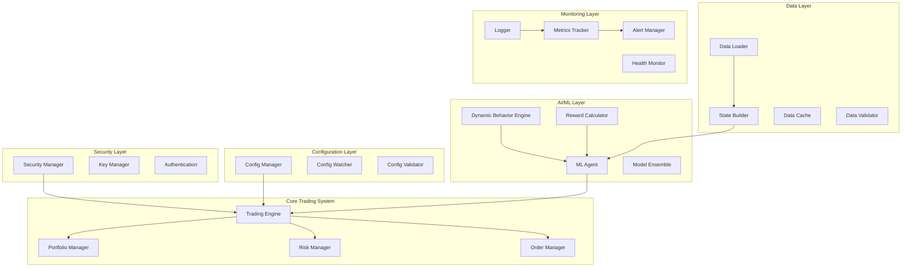

# Design Document - ADAN Trading Bot Optimization

## Overview

Cette conception transforme le bot de trading ADAN d'un prototype d'entraînement basique vers une solution de production robuste. L'architecture proposée privilégie la modularité, la sécurité, les performances et l'observabilité, permettant un développement autonome et évolutif.

Le système adopte une approche microservices avec des composants découplés, un système de configuration centralisé, et des mécanismes d'adaptation automatique aux conditions de marché.

## Gestion des Timeouts et Environnement

### TimeoutManager

```python
class TimeoutManager:
    """Gestionnaire de timeouts pour les processus d'entraînement"""
    
    def __init__(self, default_timeout: int = 3600):
        self.default_timeout = default_timeout
        self.start_time = None
        self.timeout = None
        
    def start_timer(self, timeout: Optional[int] = None):
        """Démarre le timer avec le timeout spécifié ou la valeur par défaut"""
        self.timeout = timeout if timeout is not None else self.default_timeout
        self.start_time = time.time()
        
    def check_timeout(self) -> bool:
        """Vérifie si le timeout est atteint"""
        if self.start_time is None or self.timeout is None:
            return False
        return (time.time() - self.start_time) > self.timeout
    
    def get_remaining_time(self) -> float:
        """Retourne le temps restant avant timeout"""
        if self.start_time is None or self.timeout is None:
            return float('inf')
        return max(0, self.timeout - (time.time() - self.start_time))
```

### Vérification de l'Environnement Conda

```python
class CondaEnvironmentValidator:
    """Valide l'environnement Conda et les dépendances"""
    
    REQUIRED_PACKAGES = {
        'python': '3.10',
        'pytorch': '2.0.1',
        'numpy': None,  # Toute version
        'pandas': None,
        'gymnasium': '0.29.0',
        'stable-baselines3': '2.0.0'
    }
    
    def __init__(self, env_name: str = 'trading_env'):
        self.env_name = env_name
        self.missing_packages = []
        self.wrong_versions = []
        
    def validate(self) -> bool:
        """Valide l'environnement Conda et les dépendances"""
        try:
            import pkg_resources
            import subprocess
            
            # Vérifier l'environnement Conda actif
            result = subprocess.run(
                ['conda', 'info', '--json'],
                capture_output=True, text=True
            )
            if result.returncode != 0:
                raise EnvironmentError("Conda n'est pas correctement configuré")
                
            env_info = json.loads(result.stdout)
            if not any(env['name'] == self.env_name for env in env_info['envs']):
                raise EnvironmentError(f"L'environnement Conda '{self.env_name}' n'existe pas")
                
            # Vérifier les packages requis
            for pkg, req_version in self.REQUIRED_PACKAGES.items():
                try:
                    installed = pkg_resources.get_distribution(pkg)
                    if req_version and installed.version != req_version:
                        self.wrong_versions.append(f"{pkg} (installé: {installed.version}, requis: {req_version})")
                except pkg_resources.DistributionNotFound:
                    self.missing_packages.append(pkg)
                    
            return not (self.missing_packages or self.wrong_versions)
            
        except Exception as e:
            raise EnvironmentError(f"Erreur lors de la validation de l'environnement: {str(e)}")
            
    def get_error_message(self) -> str:
        """Retourne un message d'erreur détaillé"""
        messages = []
        if self.missing_packages:
            messages.append(f"Packages manquants: {', '.join(self.missing_packages)}")
        if self.wrong_versions:
            messages.append(f"Mauvaises versions: {', '.join(self.wrong_versions)}")
        return "\n".join(messages)
```

## Architecture

### Architecture Globale



### Couches Architecturales

#### 1. Security Layer (Couche de Sécurité)
- **Security Manager**: Gestion centralisée de la sécurité
- **Key Manager**: Gestion sécurisée des clés API et secrets
- **Authentication**: Authentification et autorisation

#### 2. Configuration Layer (Couche de Configuration)
- **Config Manager**: Gestion centralisée de la configuration
- **Config Watcher**: Surveillance des changements de configuration
- **Config Validator**: Validation des configurations

#### 3. Core Trading System (Système de Trading Central)
- **Trading Engine**: Moteur principal de trading
- **Portfolio Manager**: Gestion du portefeuille optimisée
- **Risk Manager**: Gestion des risques en temps réel
- **Order Manager**: Gestion des ordres avec retry logic

#### 4. AI/ML Layer (Couche IA/ML)
- **ML Agent**: Agent d'apprentissage par renforcement optimisé
- **Dynamic Behavior Engine**: Moteur d'adaptation comportementale
- **Reward Calculator**: Calculateur de récompenses adaptatif
- **Model Ensemble**: Ensemble de modèles pour robustesse

#### 5. Data Layer (Couche de Données)
- **Data Loader**: Chargement optimisé des données
- **State Builder**: Construction d'états optimisée
- **Data Cache**: Cache intelligent multi-niveaux
- **Data Validator**: Validation et nettoyage des données

#### 6. Monitoring Layer (Couche de Surveillance)
- **Metrics Tracker**: Collecte de métriques en temps réel
- **Alert Manager**: Gestion des alertes intelligentes
- **Logger**: Système de logging structuré
- **Health Monitor**: Surveillance de la santé du système

## Components and Interfaces

### 1. Security Manager

```python
class SecurityManager:
    """Gestionnaire de sécurité centralisé"""
    
    def encrypt_sensitive_data(self, data: str) -> str:
        """Chiffre les données sensibles"""
        pass
    
    def decrypt_sensitive_data(self, encrypted_data: str) -> str:
        """Déchiffre les données sensibles"""
        pass
    
    def validate_api_access(self, api_key: str) -> bool:
        """Valide l'accès API"""
        pass
    
    def audit_log(self, action: str, user: str, timestamp: datetime) -> None:
        """Enregistre les actions pour audit"""
        pass
```

### 2. Enhanced Config Manager

```python
class EnhancedConfigManager:
    """Gestionnaire de configuration amélioré avec rechargement à chaud"""
    
    def __init__(self):
        self.config_cache = {}
        self.watchers = {}
        self.validators = {}
    
    def load_config(self, config_path: str) -> Dict[str, Any]:
        """Charge la configuration avec validation"""
        pass
    
    def watch_config_changes(self, config_path: str, callback: Callable) -> None:
        """Surveille les changements de configuration"""
        pass
    
    def validate_config(self, config: Dict[str, Any]) -> bool:
        """Valide la configuration"""
        pass
    
    def reload_config(self, config_path: str) -> None:
        """Recharge la configuration à chaud"""
        pass
```

### 3. Optimized Trading Engine

```python
class OptimizedTradingEngine:
    """Moteur de trading optimisé avec gestion d'erreurs robuste"""
    
    def __init__(self, config_manager: EnhancedConfigManager):
        self.config_manager = config_manager
        self.state = TradingState.IDLE
        self.error_count = 0
        self.max_errors = 3
    
    async def execute_trade(self, action: TradingAction) -> TradeResult:
        """Exécute un trade avec gestion d'erreurs"""
        pass
    
    def handle_error(self, error: Exception) -> None:
        """Gère les erreurs avec reprise automatique"""
        pass
    
    def save_checkpoint(self) -> None:
        """Sauvegarde l'état actuel"""
        pass
    
    def restore_from_checkpoint(self) -> None:
        """Restaure depuis le dernier checkpoint"""
        pass
```

### 4. Adaptive Reward Calculator

```python
class AdaptiveRewardCalculator:
    """Calculateur de récompenses adaptatif aux conditions de marché"""
    
    def __init__(self):
        self.market_regime_detector = MarketRegimeDetector()
        self.reward_parameters = {}
        self.adaptation_rate = 0.01
    
    def calculate_reward(self, state: MarketState, action: TradingAction, 
                        next_state: MarketState) -> float:
        """Calcule la récompense adaptative"""
        pass
    
    def adapt_parameters(self, market_volatility: float, 
                        performance_metrics: Dict[str, float]) -> None:
        """Adapte les paramètres selon les conditions"""
        pass
    
    def detect_market_regime(self, market_data: np.ndarray) -> MarketRegime:
        """Détecte le régime de marché actuel"""
        pass
```

### 5. Intelligent Cache System

```python
class IntelligentCache:
    """Système de cache intelligent multi-niveaux"""
    
    def __init__(self, max_memory_mb: int = 1024):
        self.l1_cache = {}  # Cache mémoire rapide
        self.l2_cache = {}  # Cache disque
        self.cache_stats = CacheStats()
        self.max_memory = max_memory_mb * 1024 * 1024
    
    @lru_cache(maxsize=1000)
    def get_technical_indicators(self, symbol: str, timeframe: str) -> Dict[str, float]:
        """Cache des indicateurs techniques"""
        pass
    
    def cache_market_data(self, data: MarketData) -> None:
        """Met en cache les données de marché"""
        pass
    
    def evict_old_data(self) -> None:
        """Éviction intelligente des anciennes données"""
        pass
```

## Data Models

### 1. Enhanced Market State

```python
@dataclass
class EnhancedMarketState:
    """État de marché enrichi avec métadonnées"""
    timestamp: datetime
    symbol: str
    price_data: PriceData
    technical_indicators: Dict[str, float]
    market_regime: MarketRegime
    volatility_metrics: VolatilityMetrics
    sentiment_data: Optional[SentimentData]
    metadata: Dict[str, Any]
    
    def validate(self) -> bool:
        """Valide la cohérence des données"""
        pass
    
    def to_tensor(self) -> torch.Tensor:
        """Convertit en tenseur pour le modèle"""
        pass
```

### 2. Trading Action with Confidence

```python
@dataclass
class TradingActionWithConfidence:
    """Action de trading avec niveau de confiance"""
    action_type: ActionType
    symbol: str
    quantity: float
    confidence_score: float
    reasoning: str
    risk_assessment: RiskAssessment
    expected_return: float
    max_drawdown: float
    
    def validate(self) -> bool:
        """Valide l'action proposée"""
        pass
```

### 3. Performance Metrics

```python
@dataclass
class PerformanceMetrics:
    """Métriques de performance complètes"""
    total_return: float
    sharpe_ratio: float
    sortino_ratio: float
    max_drawdown: float
    win_rate: float
    profit_factor: float
    calmar_ratio: float
    var_95: float
    expected_shortfall: float
    
    def calculate_composite_score(self) -> float:
        """Calcule un score composite"""
        pass
```

## Error Handling

### 1. Hierarchical Error Management

```python
class ErrorManager:
    """Gestionnaire d'erreurs hiérarchique"""
    
    def __init__(self):
        self.error_handlers = {
            DataError: self.handle_data_error,
            ModelError: self.handle_model_error,
            TradingError: self.handle_trading_error,
            SystemError: self.handle_system_error
        }
        self.error_count = defaultdict(int)
        self.max_retries = 3
    
    def handle_error(self, error: Exception) -> ErrorAction:
        """Gère les erreurs selon leur type"""
        pass
    
    def should_retry(self, error: Exception) -> bool:
        """Détermine si une nouvelle tentative est appropriée"""
        pass
    
    def escalate_error(self, error: Exception) -> None:
        """Escalade l'erreur vers le niveau supérieur"""
        pass
```

### 2. Circuit Breaker Pattern

```python
class CircuitBreaker:
    """Implémentation du pattern Circuit Breaker"""
    
    def __init__(self, failure_threshold: int = 5, timeout: int = 60):
        self.failure_threshold = failure_threshold
        self.timeout = timeout
        self.failure_count = 0
        self.last_failure_time = None
        self.state = CircuitState.CLOSED
    
    def call(self, func: Callable, *args, **kwargs) -> Any:
        """Exécute une fonction avec protection circuit breaker"""
        pass
    
    def record_success(self) -> None:
        """Enregistre un succès"""
        pass
    
    def record_failure(self) -> None:
        """Enregistre un échec"""
        pass
```

## Testing Strategy

### 1. Test Pyramid

```
    /\
   /  \     E2E Tests (10%)
  /____\    
 /      \   Integration Tests (20%)
/________\  Unit Tests (70%)
```

### 2. Test Categories

#### Unit Tests (70%)
- Tests de chaque composant isolément
- Mocking des dépendances externes
- Couverture de code > 80%
- Tests de performance pour les fonctions critiques

#### Integration Tests (20%)
- Tests d'interaction entre composants
- Tests de bout en bout des workflows
- Tests de charge et de stress
- Tests de récupération après panne

#### End-to-End Tests (10%)
- Tests complets du système
- Tests avec données réelles (sandbox)
- Tests de déploiement
- Tests de monitoring et alertes

### 3. Test Infrastructure

```python
class TestInfrastructure:
    """Infrastructure de test automatisée"""
    
    def setup_test_environment(self) -> TestEnvironment:
        """Configure l'environnement de test"""
        pass
    
    def generate_synthetic_data(self, scenario: TestScenario) -> MarketData:
        """Génère des données synthétiques pour les tests"""
        pass
    
    def run_performance_benchmarks(self) -> BenchmarkResults:
        """Exécute les benchmarks de performance"""
        pass
    
    def validate_model_accuracy(self, model: MLModel) -> AccuracyMetrics:
        """Valide la précision du modèle"""
        pass
```

## Performance Optimizations

### 1. Memory Management

```python
class MemoryManager:
    """Gestionnaire de mémoire optimisé"""
    
    def __init__(self, max_memory_gb: float = 8.0):
        self.max_memory = max_memory_gb * 1024**3
        self.current_usage = 0
        self.memory_pools = {}
    
    def allocate_tensor_memory(self, size: Tuple[int, ...]) -> torch.Tensor:
        """Alloue la mémoire pour les tenseurs de manière optimisée"""
        pass
    
    def garbage_collect_if_needed(self) -> None:
        """Déclenche le garbage collection si nécessaire"""
        pass
    
    def monitor_memory_usage(self) -> MemoryStats:
        """Surveille l'utilisation mémoire"""
        pass
```

### 2. Compute Optimizations

```python
class ComputeOptimizer:
    """Optimiseur de calculs"""
    
    def __init__(self):
        self.device = torch.device("cuda" if torch.cuda.is_available() else "cpu")
        self.mixed_precision = True
        self.compile_models = True
    
    def optimize_model(self, model: nn.Module) -> nn.Module:
        """Optimise le modèle pour les performances"""
        if self.compile_models:
            model = torch.compile(model)
        return model
    
    def setup_mixed_precision(self) -> GradScaler:
        """Configure la précision mixte"""
        pass
    
    def batch_process_data(self, data: List[Any], batch_size: int) -> Iterator[List[Any]]:
        """Traite les données par lots pour optimiser les performances"""
        pass
```

## Monitoring and Observability

### 1. Metrics Collection

```python
class MetricsCollector:
    """Collecteur de métriques avancé"""
    
    def __init__(self):
        self.metrics_buffer = deque(maxlen=10000)
        self.aggregators = {}
        self.exporters = []
    
    def collect_trading_metrics(self, trade_result: TradeResult) -> None:
        """Collecte les métriques de trading"""
        pass
    
    def collect_model_metrics(self, model_output: ModelOutput) -> None:
        """Collecte les métriques du modèle"""
        pass
    
    def collect_system_metrics(self) -> SystemMetrics:
        """Collecte les métriques système"""
        pass
    
    def export_metrics(self, format: str = "prometheus") -> str:
        """Exporte les métriques dans le format spécifié"""
        pass
```

### 2. Alert System

```python
class AlertSystem:
    """Système d'alertes intelligent"""
    
    def __init__(self):
        self.alert_rules = []
        self.notification_channels = []
        self.alert_history = deque(maxlen=1000)
    
    def add_alert_rule(self, rule: AlertRule) -> None:
        """Ajoute une règle d'alerte"""
        pass
    
    def evaluate_alerts(self, metrics: Dict[str, float]) -> List[Alert]:
        """Évalue les règles d'alerte"""
        pass
    
    def send_notification(self, alert: Alert) -> None:
        """Envoie une notification"""
        pass
    
    def suppress_duplicate_alerts(self, alert: Alert) -> bool:
        """Supprime les alertes en double"""
        pass
```

Cette conception fournit une base solide pour transformer le bot ADAN en une solution de production robuste, avec tous les composants nécessaires pour un développement autonome et évolutif.